디자인 패턴 목록

1. Strategy Pattern
2. Observer Pattern
3. Template Method pattern
4. Iterator Pattern
5. State Pattern
6. Mediator Pattern
7. Factory Method Pattern
8. Abstract Factory Method Pattern
9. Builder Pattern
10. Singleton Pattern
11. Decorator Pattern
12. Adapter Pattern
13. Composite Pattern
14. Bridge Pattern
15. MVC Pattern


# Strategy Pattern

> 동일 계열의 알고리즘군을 정하고, 각 알고리즘을 캡슐화하며, 이들을 상호교환이 가능하도록 만듭니다. 알고리즘을 사용하는 클라이언트와 상관없이 독립적으로 알고리즘을 다양하게 변경할 수 있게 합니다. 

### Use when

- 연관된 클래스의 다른점이 오직 행동일 때
- 다양한 버전 또는 변형의 알고리즘이 요구 될 때
- 클래스의 행동(behavior)가 runtime에 정의 될 때
- 조건문이 복잡하고 유지가 어려울 때 

### 디자인 원칙

* composition

* delegation

  

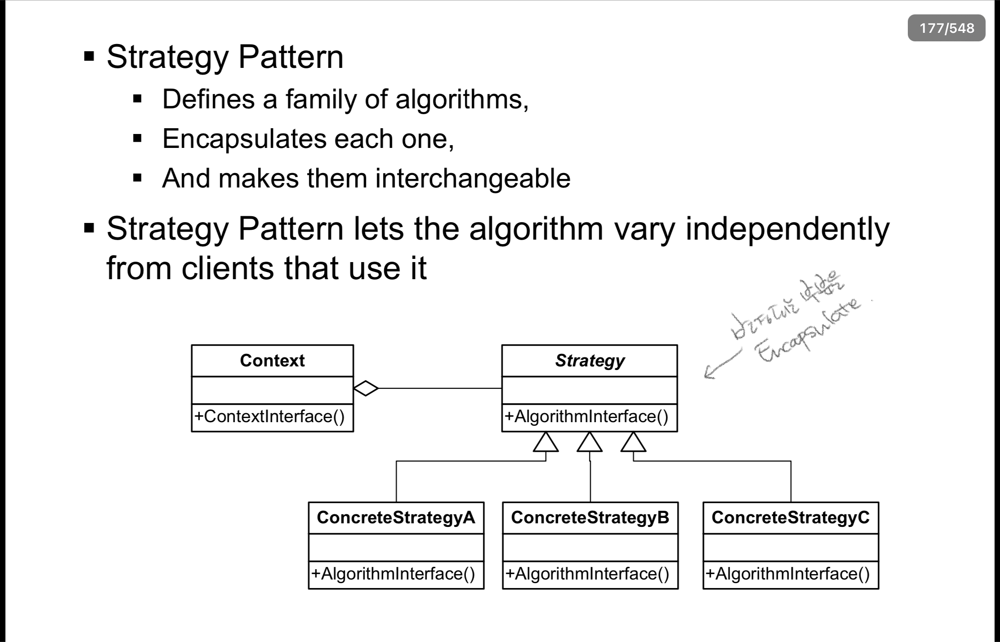


# Observer Pattern

> 객체 사이에 일 대 다의 의존 관계를 정의해 두어, 어떤 객체의 상태가 변할 때 그 객체에 의존성을 가진 다른 객체들이 그 변화를 통지 받고 자동으로 갱신될 수  있게 만든다.

### Use When

* 통신을 하면서 Loose coupling이 필요할 때
* Broadcasting 이 필요할 때
* 상태 변화를 하나 또는 여러 객체에 알릴 때

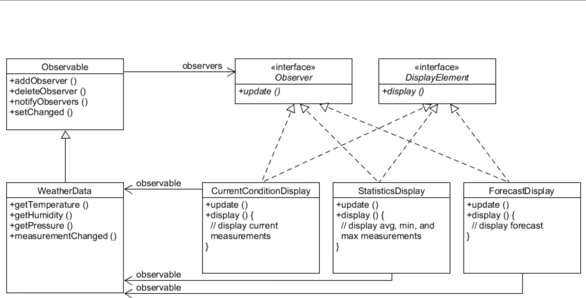


# Template Method Pattern

> 객체의 연산에는 알고리즘의 뼈대만을 정의하고 각 단계에서 수행할 구체적 처리는 서브클래스 쪽으로 미룹니다. 알고리즘의 구조 자체는 그대로 놔둔 채 알고리즘 각 단계 처리를 서브클래스에서 재정의 할 수 있게 합니다.
>
> (스텝 정의라고 생각)

## Use When

* 어떤 한 알고리즘을 이루는 부분 중 변하지 않는 부분을 한 번 정의해 놓고 다양해질 수 있는 부분은 서브클래스에서 정의 할 수 있도록 할 때

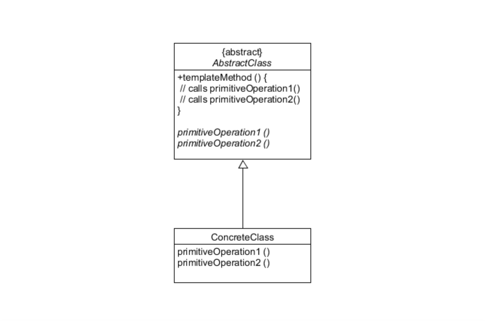

# Iterator

> 내부 표현부를 노출하지 않고 어떤 집합 객체에 속한 원소들을 순차적으로 접근할 수 있는 방법을 제공합니다.

### Use When

* 각 요소에 접근하되 내부 전체를 노출 하고 싶지 않을 때
* 집합 객체를 순회하는 다양한 방법을 지원하고 싶을 때


### 디자인 원칙

* Single Responsibility (SRP)


# State Pattern

> 객체의 내부 상태에 따라 스스로 행동을 변경할 수 있게 허가하는 패턴으로, 이렇게 하면 객체는 마치 자신의 클래스를 바꾸는 것처럼 보인다.

### Use When

* Object의 행동이 상태에 영향을 받을 때
* 상태에 따라 복잡한 조건이 걸려 있을 때
* 상태에 따라 명확한 분리가 필요할 때

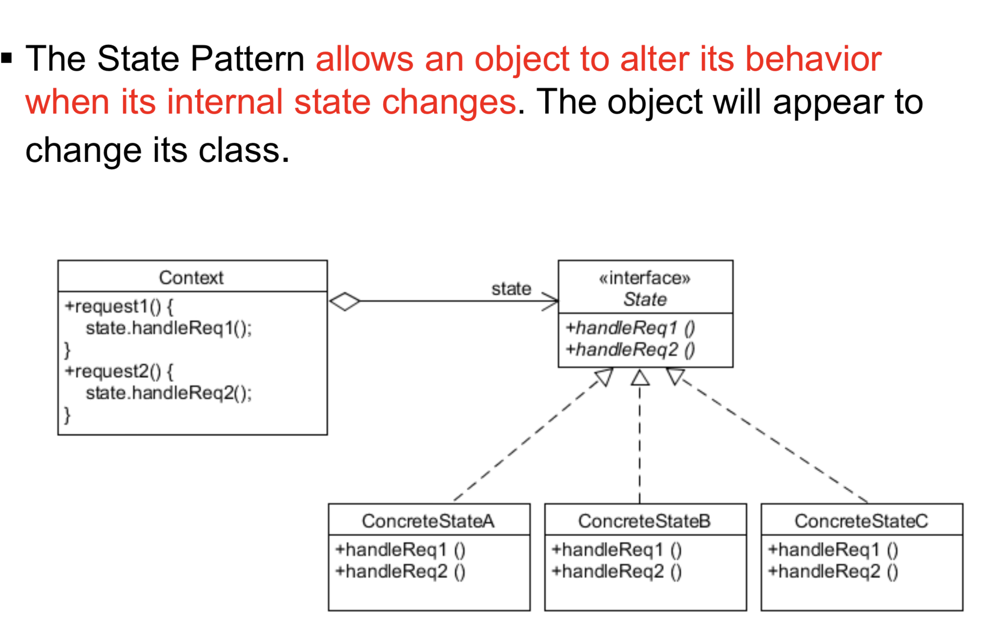

### 디자인 원칙 

* OCP

### 다른 패턴과의 유사성

* 전략 패턴과 유사하지만, 의도의 차이가 있다.
  * State패턴은 각각의 state행동을 encapsulate한다.
  * 전략패턴은 알고리즘을 encapsulate한다.
* 전략 패턴과 state패턴 모두 composition과 delegation을 활용한다.


# Mediator Pattern

> 한 집합에 속해있는 객체의 상호작용을 캡슐화하는 객체를 정의합니다. 객체들이 직접 서로를 참조하지 않도록 하여 객체 사이의 소결합을 촉진시키며, 개발자가 객체의 상호작용을 독립적으로 다양화시킬 수 있게 만듭니다.
>
> like 관제실

### Use When

* Objects간의 메세지가 복잡할 때
* 너무 많은 관계가 존재하고, 그들사이의 복잡한 커뮤니케이션이 필요할 때

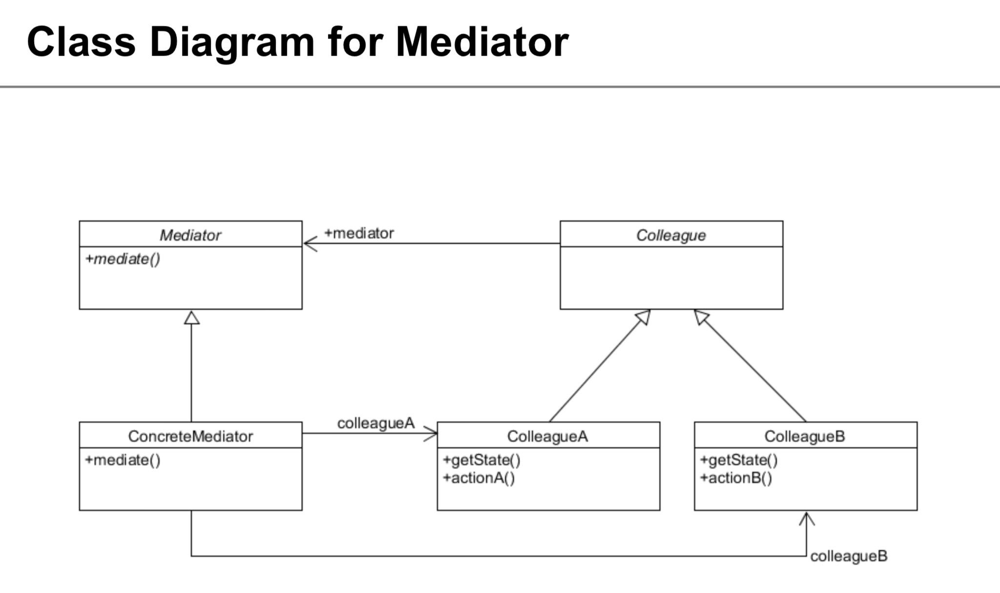

### 특징

* 각각의 object는 encapsulate하고, mediator를 통해서만 커뮤니케이션
* 각각의 클래스들은 loose coupling

장점

* easy to understand

단점

* hardly ever reusable


## * 생성 패턴

> new를 사용하지 안하고 objects를 만들도록 하는 것. client의 코드를 수정하지 않고도 object를 생성할 수 있음. 
>
> 대표적인 예로 factory method, abstract factroy, sington, builder 등이 있음

### factory method

* 상속을 통해 object를 instantiated

### abstract factory

* factory object에 object생성을 delegation한다.


# Factory Method Pattern

> 객체를 생성하기 위해 인터페이스를 정의하지만, 어떤 클래스의 인스턴스를 생성할지에 대한 결정은 서브클래스가 내리도록한다. 

### Use When

* 어떤 클래스가 생성될 지 모를때
* Subclasses에서 어떤 object가 생성될지 특정될 때

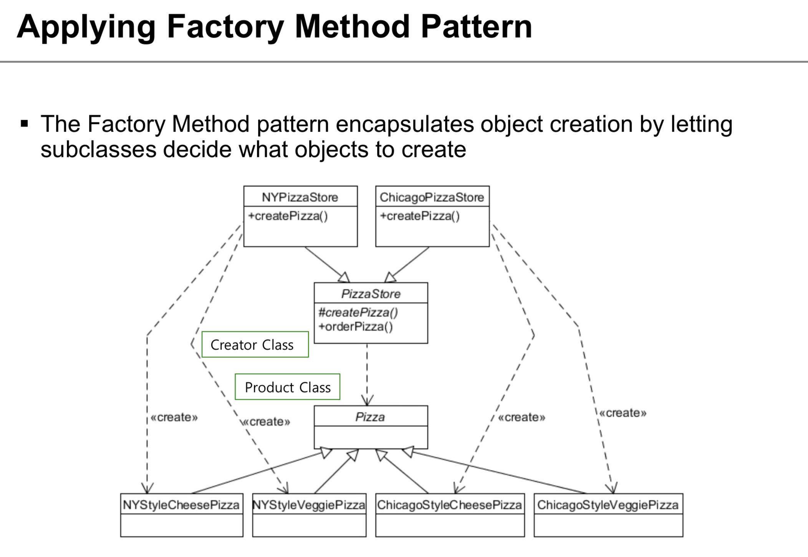


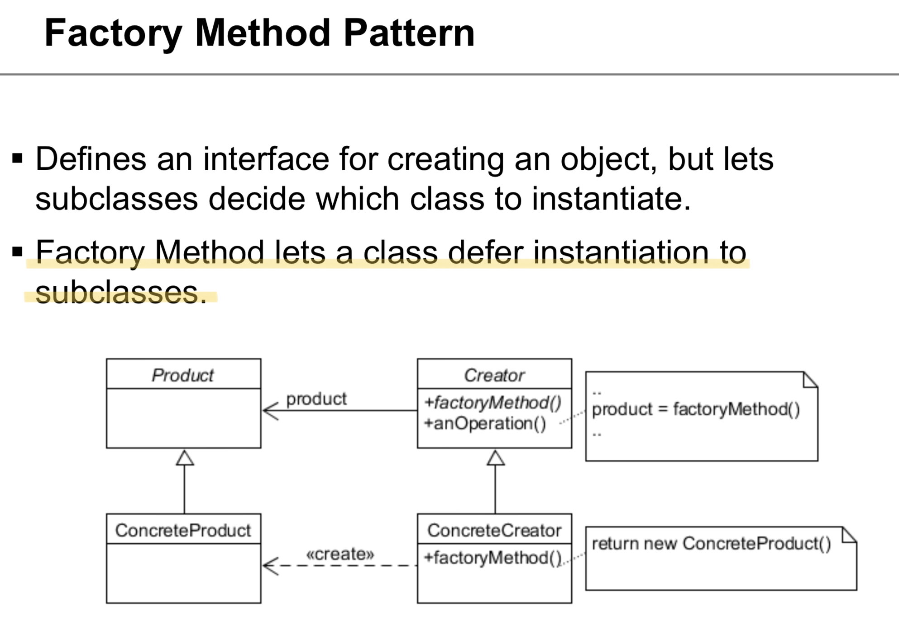

### 디자인 원칙

* DIP 
  * Depend upon abstraction. Do not depend upon concrete classes
  * High-level components should not depend on low-level components

### 주의할 점

* Runtime에 어떤 object를 생성할 지 정하는 것은 아니다.


# Abstract Factory Pattern

> 상세화된 서브클래스를 정의하지 않고도 서로 관련성이 있거나 독립적인 여러 객체의 군을 생성하기 위한 인터페이스를 제공합니다.

### Use When

* 객체가 생성되거나 구성, 표현되는 방식과 무관하게 시스템을 독립적으로 만들고자 할 때 
* 여러 제품군 중 하나를 선택해서 시스템을 설정해야 하고 한번 구성한 제품을 다른 것으로 대체할 수 있을 때
* 관련된 제품 객체들이 함께 사용되도록 설계되었고, 이 부분에 대한 제약이 외부에도  지켜지도록 하고 싶을 때
* 제품에 대한 클래스 라이브러리를 제공하고, 그들의 구현이 아닌 인터페이스를 노출시키고 싶을 때


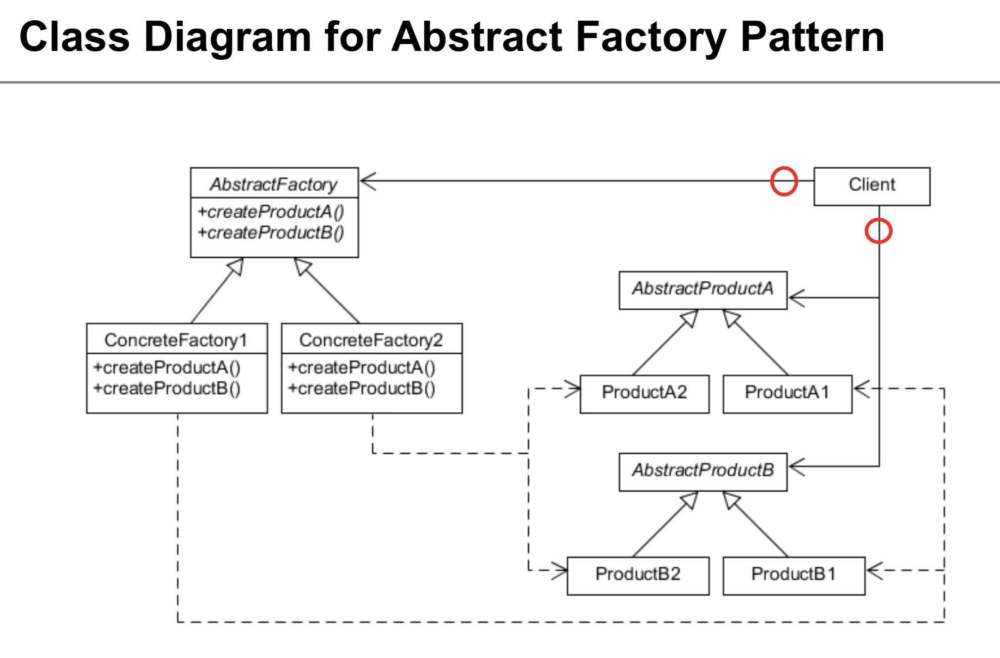

### 결과

* 구체적인 클래스를 분리합니다.
* 제품군을 쉽게 대체할 수 있도록 합니다.
* 제품 사이의 일관성을 증진시킵니다.
* 새로운 종류의 제품을 제공하기 어렵습니다.

# Builder Pattern

> 복잡한 객체를 생성하는 방법과 표현하는 방법을 정의하는 클래스를 별도로 분리하여, 서로 다른 표현이라도 이를 생성할 수 있는 동일한 절차를 제공할 수 있도록 한다.

### Use When

* Runtime에서 create process 컨트롤이 필요할 때
* 다양한 생성 알고리즘이 푤요할 때
* Object 생성 알고리즘이 system에서 분리 되어야 할 때
* 생성 기능이 추가 될 때 코어 코드를 건들고 싶지 않을 때

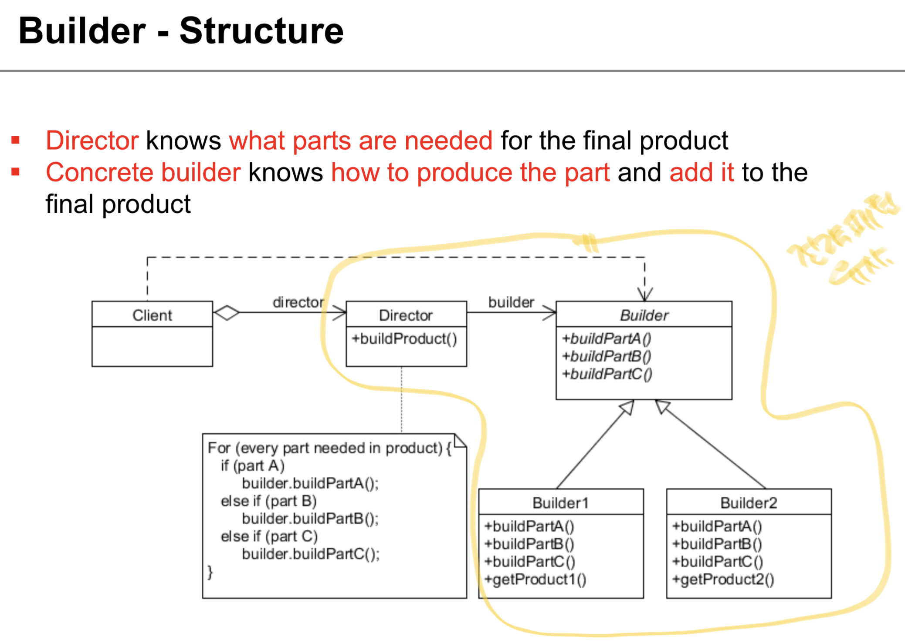


### 관련패턴

* 추상 팩토리 패턴과 유사함
  * builder는 객체의 각 생성에 중점을 둠
  * abstract factory는 제품의 유사군들이 존재할 때 유연한 설계에 중점을 둠
  * builder는 마지막 단계에서 product를 반환함
  * abstract factory는 만드는 즉시 제품을 반환함


# Singleton Pattern

> 오직 한 개의 클래스 인스턴스만을 갖도록 보장하고, 이에 대한 전역적인 접근점을 제공한다


### Use When

* 하나의 인스턴스의 클래스가 필요할 때
* 잘 정의된 접근점으로 모든 사용자가 접근할 수 있도록 해야할 때


### Issue

* Multi-threading issue


### Basic code (not considering multithread)

```java
public class Singleton {
  private static Singleton uniqueInstance;
  
  // private으로 선언해서, client가 new로 생성하지 못하게
  private Singleton() {}
  
  public static Singleton getInstance() {
    if (uniqueInstance == null) {
      uniqueInstance = new Singleton();
    }
    return uniqueInstance;
  }
  
  // ...
}
```


### solution #1

```java
public class Singleton {
  private static Singleton uniqueInstance;
  
  // private으로 선언해서, client가 new로 생성하지 못하게
  private Singleton() {}
  
  public static synchronized Singleton getInstance() {
    if (uniqueInstance == null) {
      uniqueInstance = new Singleton();
    }
    return uniqueInstance;
  }
  
  // ...
}
```

getInstance 부분을 synchronized하면, 문제가 해결된다.

그러나 많은 요청이 있을 때, lock이 많이 발생하게 되어 performance가 저하된다.


### solution #2 

```java
public class Singleton {
  private static Singleton uniqueInstance;
  
  // private으로 선언해서, client가 new로 생성하지 못하게
  private Singleton() {}
  
  public static Singleton getInstance() {
    return uniqueInstance;
  }
  // ...
}
```

생성과 동시에 instance를 무조건 만든다. 누구의 요청이 없더라도..

Singleton 클래스가 작으면 크게 문제가 되지 않지만 보통 Singleton으로 만들려는 객체가 큰 경우가 대부분이므로, 


### single checking (x)

```java
public class Singleton {
  private static Singleton uniqueInstance;
  
  // private으로 선언해서, client가 new로 생성하지 못하게
  private Singleton() {}
  
  public static Singleton getInstance() {
    if (uniqueInstance == null) {
      // A,B 둘 중 하나가 먼저 lock을 얻어내면, 예를 들어 A가 먼저 얻어 나가면, B는 또 lock을 한다
      synchronized(Singleton.class) {
       		uniqueInstance = new Singleton();   
      }
    }
    return uniqueInstance;
  }
  // ...
}
```


### Double checking (almost ok)

```java
public class Singleton {
  private static Singleton uniqueInstance;
  
  // private으로 선언해서, client가 new로 생성하지 못하게
  private Singleton() {}
  
  public static Singleton getInstance() {
    if (uniqueInstance == null) {
      synchronized(Singleton.class) {
        if (uniqueInstance == null) {
       		uniqueInstance = new Singleton();   
        }  
      }
    }
    return uniqueInstance;
  }
  // ...
}
```

이론적으로는 double-checking으로 문제가 해결 가능.

그러나 real-world에서 문제가 발생한다.

A, B모두 uniqueInstance를 공유한다. 아직 A가 생성 중일 때, 즉 생성이 완료되지 않았지만 B 입장에서는 null은 아니므로 미완성된 인스턴스를 받아서 작업을 진행된다. 따라서 런타임 에러가 발생한다.


### Corrected Double-Checked Locking (Option 3)

```java
public class Singleton {
  private volatile static Singleton uniqueInstance;
  
  // private으로 선언해서, client가 new로 생성하지 못하게
  private Singleton() {}
  
  public static Singleton getInstance() {
    if (uniqueInstance == null) {
      synchronized(Singleton.class) {
        if (uniqueInstance == null) {
       		uniqueInstance = new Singleton();   
        }  
      }
    }
    return uniqueInstance;
  }
  // ...
}
```

인스턴스를 volatile로 선언한다. share variable이 여러 thread에서 sync됨을 보장하는 예약어.


# Decorator Pattern

> 객체에 동적으로 새로운 책임을 추가할 수 있게 한다. 기능을 추가하려면, 서브클래스를 생성하는 것보다 융통성 있는 방법을 제공한다.


### Use When

* object 의 책임과 행동이 동적으로 변화해야 할 때
* 동적으로 다른객체에 영향을 주지 않고 객체에 새로운 책임을 추가하기 위해
* 실제 상속으로 서브클래스를 만드는 방법이 실질적이지 못할 때


### 디자인 원칙

* OCP
  * 모든 케이스에 적용하는 것은 권장하지 않는다


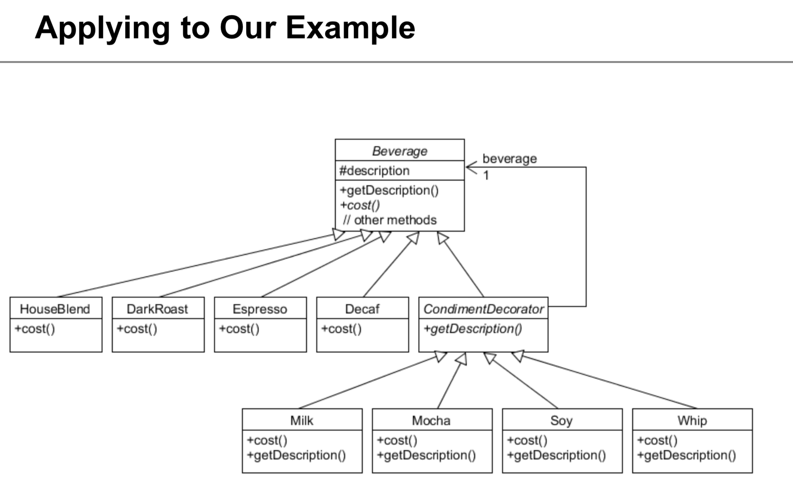


### 적용

* JAVA IO에 적용


# Adapter Pattern

> 클래스의 인터페이스를 사용자가 기대하는 인터페이스 형태로 적응(변환) 시킨다. 서로 일치하지 않는 인터페이스를 갖는 클래스들을 함께 동작시킴.


### Use When

* 인터페이스가 맞지 않을 때


# Composite Pattern

> 부분과 전체의 계층을 표현하기 위해 객체들을 모아 트리 구조로 구성한다. 사용자로 하여금 개별 객체와 복합 객체를 모두 동일하게 다룰 수 있도록하는 패턴.


### Use When

* 트리구조의 표현이 필요할 때
* 복합체, 단일 객체 모두 같게 취급하고 싶을 때


# Bridge Pattern

> 구현에서 추상을 분리하여, 이들이 독립적으로 다양성을 가질 수 있도록 한다


### Use When

* abstraction 과 implementation이 컴파일 타임에 묶이면 안될 때
* abstraction 과 implementation이 독립적으로 확장 될 때
* 추상의 구현 클래스 변경이 클라이언트에 영향을 주지 않아야할 때
* 구현의 내용을 클라이언트에게 오픈하고 싶지 않을 때


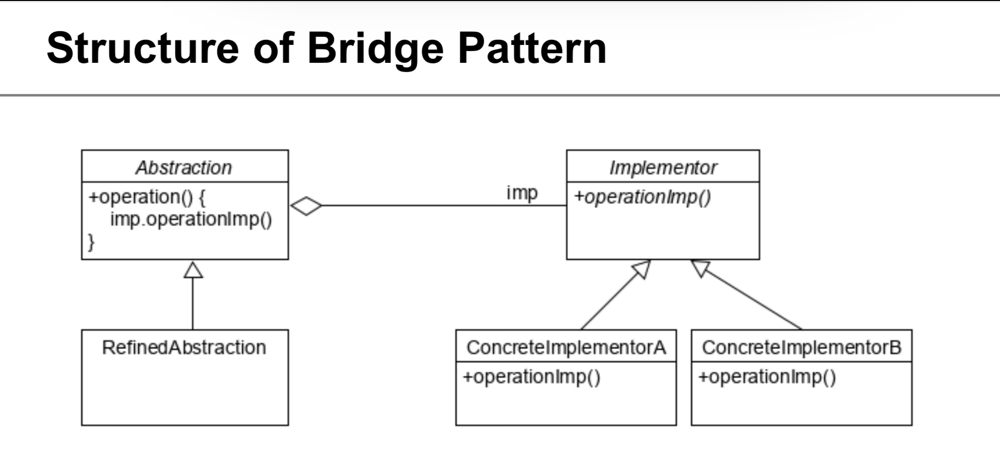


# 노트

* 전략패턴, 상태패턴, 브릿지 패턴 유사


